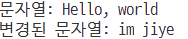

# std::string 클래스

작성일시: 2023년 11월 7일 오후 8:46
유형: c++

---

# std::string

- C++ 표준 라이브러리에서 제공하는 문자열 클래스이다.
- 동적으로 메모리를 할당하여 저장하므로 문자열의 길이에 따라 자동으로 크기가 조절된다.
- 다양한 내장 함수를 제공한다.
- string파일을 인클루드 하면 사용가능하다. `#include <string>`

### 선언

`string a;`

a라는 문자열을 선언했다. 문자열의 길이는 알아서 정해지므로 길이에 대한 정보는 쓰지 않아도 된다. 

일반 변수처럼 취급할 수 있기 때문에 a를 선언한 이후에도 strcpy같은 함수의 도움 없이 다른 문자열을 바로 대입할 수 있다. 

```cpp
#include <iostream>
#include <string>
using namespace std;

int main(){
    string a = "Hello, world";
    cout << "문자열: " << a << '\n';

    a="im jiye";
    cout << "변경된 문자열: "<< a <<'\n';
}
```

➡️ 실행결과

<center></center>

문자열의 n번째 칸에 들어 있는 문자를 얻어오거나 다른 문자로 바꿀 수 있다. 

## 연산과 입출력

- +연산자를 사용하여 문자열끼리 이어 붙인 새로운 문자열을 만들 수 있다. += 연산자도 사용 가능하다.
- 비교 연산자를 사용 가능하다. ==연산으로 두 문자열이 같은지 판별 가능하다. 또한 <, > 연산자로 문자의 사전적인 비교도 가능하다.
- cin과 cout을 통해 입출력을 할 수 있다. 공백을 포함해 입력받으려면 `getline()`함수를 이용하면 된다. getline(cin, str).
- `getline(in_stream, str, delim)` : 입력 스트림에서 문자들을 읽어서 인자로 받은 문자열에 저장한다. 문자를 읽다가 `delim` 문자를 읽게 되면 해당 문자를 버리고 읽어들이기를 종료한다. `delim` 을 지정하지 않으면 디폴트는 개행 문자(’\n’)이다.
- `getline()` 주의사항 : 입력 방식 중에 공백문자를 스트림에 남겨놓는 입력방식 뒤에 (ex. cin >> ) getline 을 바로 호출하게 된다면, getline 은 해당 공백문자를 읽고 바로 읽기를 종료하게 된다. 이를 방지하려면 스트림에서 남아 있는 공백문자를 지워줘야 한다.

## 멤버함수

| s.insert(pos, s2) | s의 pos위치에 s2를 삽입 |
| --- | --- |
| s.find(s2) | s에서 문자열 s2가 발견되는 첫번째 인덱스를 반환 |
| s.at(pos) | s에서 pos위치에 있는 문자를 반환 |
| s.erase(pos, len) | s의 pos위치부터 len만큼을 삭제 |
| s.empty() | s가 비어있으면 true를 반환 |
- at() 함수 : pos가 문자열 내 유효한 위치인지 판단하여 그렇지 않은 경우 out_of_range 에러를 발생시킨다. (operator[]의 경우에는 프로그램이 죽는다.)

## char 배열과의 차이점

- char 배열:
    
    단순한 문자들의 배열로, 문자열을 저장하기 위해 연속된 메모리를 정적으로 할당한다. 
    
    크기가 정해져 있으며, 정적 할당이므로 실행 시간에 크기를 조절할 수 없다. 할당된 메모리는 스택 영역에 위치한다. 
    
- string:
    
    동적으로 메모리를 할당하고 필요에 따라 크기를 조절할 수 있다. 메모리는 힙 영역에 할당된다. 
    

---

# 참고자료

[C++ 스터디 #8: 문자열 - KAsimov Wiki](https://kasimov.korea.ac.kr/dokuwiki/doku.php/activity/public/2021/cpp/210629)

[C++ 에서 string 문자열과 char 배열 비교하기](https://parodev.tistory.com/59)

[c++ std::string의 원소 접근 방법 정리(front, back, at, operator)](https://hoho325.tistory.com/318)

[<string> 함수](https://learn.microsoft.com/ko-kr/cpp/standard-library/string-functions?view=msvc-170#getline)